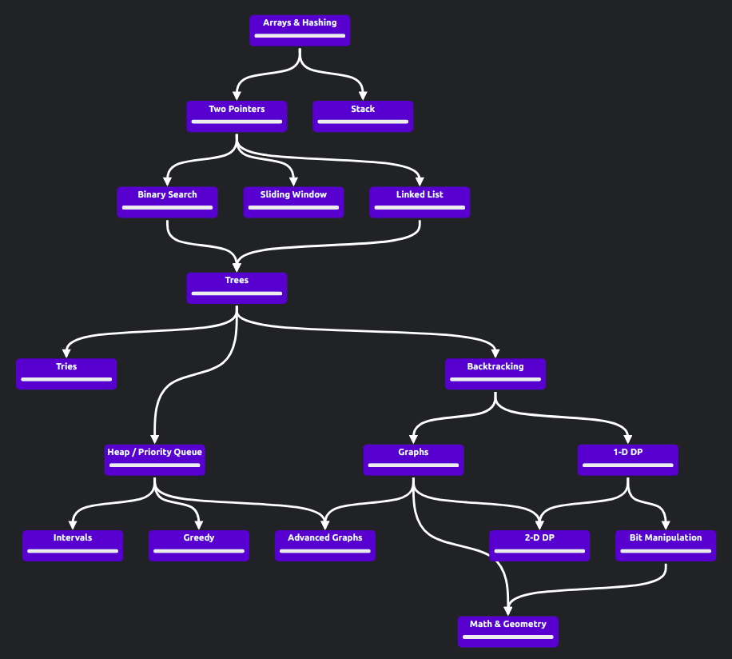

# Algorithms and data structures

## Topics
| Topic            | Algorithms and data structures                                                                                                                                                                                                                                                                                                                                                                                                                                                                                                                                                                                                                                                                                                                                                                                                                                                                                                                                                                                                                                      | 
|------------------|---------------------------------------------------------------------------------------------------------------------------------------------------------------------------------------------------------------------------------------------------------------------------------------------------------------------------------------------------------------------------------------------------------------------------------------------------------------------------------------------------------------------------------------------------------------------------------------------------------------------------------------------------------------------------------------------------------------------------------------------------------------------------------------------------------------------------------------------------------------------------------------------------------------------------------------------------------------------------------------------------------------------------------------------------------------------|
| Структуры данных | <ul><li><input type="checkbox" disabled /> Массив (array) </li><li><input type="checkbox" disabled /> Стек (stack) </li><li><input type="checkbox" disabled /> Очередь (queue) </li><li><input type="checkbox" disabled /> Связный список (linked list) </li><li> <input type="checkbox" disabled /> Словарь </li> <li> <input type="checkbox" disabled /> Строка </li><li><input type="checkbox" disabled /> Множества </li><li> <input type="checkbox" disabled /> Дерево (tree) </li> <li> <input type="checkbox" disabled /> Граф (graph) </li><li><input type="checkbox" disabled /> Префиксное дерево (trie) </li><li><input type="checkbox" disabled /> Хэш-таблица (hash table) </li><li><input type="checkbox" disabled /> Геометрические структуры данных </li></ul>                                                                                                                                                                                                                                                                                      |
| Сортировки       | <ul><li> <input type="checkbox" disabled /> Сортировка пузырьком (bubble sort) </li><li> <input type="checkbox" disabled /> Сортировка перемешиванием (сocktail sort) </li> <li><input type="checkbox" disabled /> Сортировка вставками (insertion sort)</li><li><input type="checkbox" disabled /> Гномья сортировка (gnome sort)</li><li><input type="checkbox" disabled />Сортировка слиянием (merge sort)</li><li><input type="checkbox" disabled />Сортировка с помощью двоичного дерева (tree sort)</li><li><input type="checkbox" disabled />Сортировка Timsort</li><li><input type="checkbox" disabled />Сортировка выбором (selection sort)</li><li><input type="checkbox" disabled />Сортировка расчёской (comb sort)</li><li><input type="checkbox" disabled />Сортировка Шелла (shell sort)</li><li><input type="checkbox" disabled />Пирамидальная сортировка (сортировка кучи, heapsort)</li><li><input type="checkbox" disabled />Плавная сортировка (smoothsort)</li><li><input type="checkbox" disabled />Быстрая сортировка (quicksort)</li></ul> |
| Поиск            | <ul><li> <input type="checkbox" disabled /> Двоичное дерево поиска (BST) </li><li> <input type="checkbox" disabled /> Красно-черное дерево </li></ul>                                                                                                                                                                                                                                                                                                                                                                                                                                                                                                                                                                                                                                                                                                                                                                                                                                                                                                               |
| Графы            | <ul><li> <input type="checkbox" disabled /> Обход графа в ширину (BFS) </li><li> <input type="checkbox" disabled /> Обход графа в глубину (DFS) </li> <li> <input type="checkbox" disabled /> Алгоритм Прима </li> <li> <input type="checkbox" disabled /> Алгоритм Краскала </li><li> <input type="checkbox" disabled /> Алгоритм Дейкстры </li></ul>                                                                                                                                                                                                                                                                                                                                                                                                                                                                                                                                                                                                                                                                                                              |
| Строки           | <ul><li> <input type="checkbox" disabled /> Radix sorts </li><li> <input type="checkbox" disabled /> Tries </li> <li> <input type="checkbox" disabled /> KMP </li> <li> <input type="checkbox" disabled /> Регулярные выражения </li></ul>                                                                                                                                                                                                                                                                                                                                                                                                                                                                                                                                                                                                                                                                                                                                                                                                                          |
| Advanced         | <ul><li> <input type="checkbox" disabled /> B-tree </li><li> <input type="checkbox" disabled /> Suffix array </li> <li> <input type="checkbox" disabled /> Maxflow </li><li> <input type="checkbox" disabled /> Ахо-Корасик </li> </ul>                                                                                                                                                                                                                                                                                                                                                                                                                                                                                                                                                                                                                                                                                                                                                                                                                             |

## [Road map со ссылками на упражнения](https://neetcode.io/roadmap)

## Литература
* "Алгоритмы. Руководство по разработке" Стивен Скиена
* "Алгоритмы" Роберт Седжвик, Кевин Уэйн
* "Ресурсно-эффективные компьютерные алгоритмы" Ульянов
* [LeetCode](https://leetcode.com/)
* [NeetCode](https://neetcode.io/practice)
* [Яндекс Контест](https://contest.yandex.ru/)
* [Яндекс тренировки по алгоритмам](https://yandex.ru/yaintern/algorithm-training)
* [Timus Online Judge](https://acm.timus.ru/)
* [Topcoder](https://www.topcoder.com/)
* [Codeforces](https://codeforces.com/)
* [HakerRank](https://www.hackerrank.com/)
* [Алгоритмы и структуры данных - Computer Science Center](https://www.youtube.com/playlist?list=PLlb7e2G7aSpQutUr7qYIunvm04cqdr5mx)
* [Курс «Алгоритмы и структуры данных поиска» - Бабенко](https://www.youtube.com/playlist?list=PLJOzdkh8T5koEPv-R5W0ovmL_T2BjB1HX)
* [Курс по алгоритмам, Школа анализа данных](https://www.youtube.com/playlist?list=PLJOzdkh8T5koY39DBaUhD7_GlOfcMJqyZ)
* [Algorithm visualizer](https://algorithm-visualizer.org/)

## Leetcode интервью
* Длительность ~40 минут
* 2 easy + medium/hard
* Сервис совместной правки кода, например, [sharepad](https://sharepad.io/)
